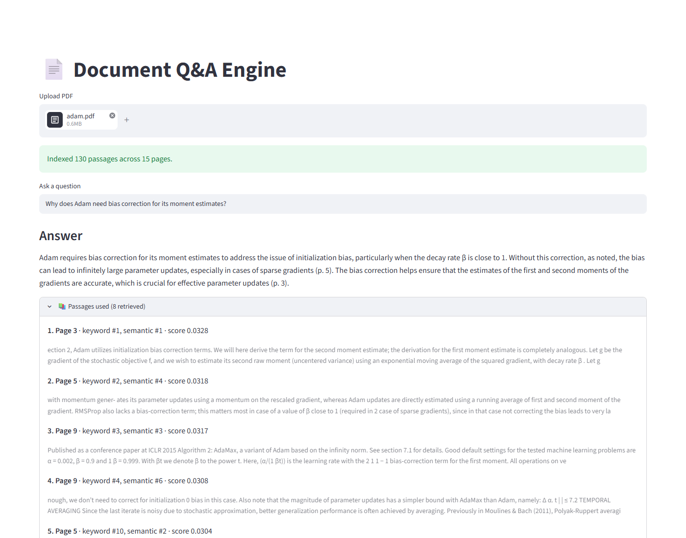

# Document Q&A Engine

**Upload a PDF, ask a question, get an answer grounded in the document — with the page it came from.**

DocEngine is a small Retrieval-Augmented Generation system built around one idea:
retrieve the relevant parts of a document first, then let the model answer using
only those passages.

Live demo: https://doc--engine.streamlit.app/

<p align="center">
  
</p>
<p align="center"><em>The Adam paper indexed. The answer cites its pages, and each source passage shows its page and how it was matched.</em></p>

## Accuracy

Measured on a held-out test split of 70 questions over four documents (two
technical papers, the NIST AI Risk Management Framework, and the IPCC AR6
summary), none of which were used while tuning:

| | Previous version | Current | Change |
| --- | --- | --- | --- |
| **Correct answers** | 75.0% | **86.8%** | +11.8 pts |
| Correct, questions reworded away from the document's wording | 69.7% | 84.8% | +15.1 |
| Right passage among those retrieved | 76.5% | 89.7% | +13.2 |
| Answer cites a page the evidence is on | 80.9% | 86.8% | +5.9 |
| Citation precision | 79.0% | 83.6% | +4.6 |
| Declined questions the document cannot answer | 2 of 2 | 2 of 2 | |

Correctness is judged by `gpt-4.1-mini` against reference answers; the judge
agrees with hand labels on 93.5% of answers and, where it disagrees, is stricter
than a person. How the set was built, every configuration that was tried
(including the ones that did not help), and the remaining errors are in
**[evaluation/ACCURACY.md](evaluation/ACCURACY.md)**.

## The pipeline

```text
PDF
 ↓  pdfplumber, page by page; rotated text rebuilt, line-break hyphenation repaired
pages
 ↓  whole-sentence chunks up to 600 characters, never crossing a page boundary
chunks (each tagged with its page)
 ↓  bge-small-en-v1.5 embeddings, L2-normalised
FAISS inner-product index

question
 ↓  gpt-4o-mini rewrites it as a standalone query and drafts a hypothetical answer
three phrasings
 ↓  each: keyword ranking + semantic ranking, fused, then reranked by a cross-encoder
 ↓  the three rankings fused
top 8 passages → gpt-4o-mini, answering only from them, citing pages
```

## Retrieval

This is the part of the system that decides what the model is allowed to see, so
it is the part worth explaining.

**Keyword.** The query is tokenised: lowercased, punctuation stripped, stopwords
removed, numbers kept. Chunks are scored by how much of the query's content
vocabulary they contain, weighted so that a rare term counts for more than a
common one, and scaled by what fraction of the query the chunk covers.

**Semantic.** The query is embedded with the instruction prefix bge models are
trained with and matched against the FAISS index by cosine similarity.

The two rankings are combined with Reciprocal Rank Fusion: each contributes
`1 / (60 + rank)` to the chunks it ranks highly. RRF fuses *rankings* rather than
scores, which avoids inventing a common scale for a keyword weight and a cosine
similarity. Removing the keyword half cost 8 points of recall.

**Reranking.** The top 30 fused candidates are rescored by a cross-encoder
(`ms-marco-MiniLM-L-6-v2`), which reads the question and passage together. This
was the largest single gain in ranking the right passage first (44% to 58%).

**Query expansion.** Readers ask about "it" and use their own words; documents
use their own terms. Before searching, the model is shown the document's opening
and asked for a standalone rewrite and a one-sentence hypothetical answer. Each
phrasing is searched and reranked separately, and the three rankings are fused.
This took recall from 84% to 92% on the development split. If the call fails,
search proceeds with the original question.

**Sentence chunks.** Chunks end on sentence boundaries (with common abbreviations
protected) instead of cutting sentences in half, and each chunk repeats the last
sentence of the previous one.

An earlier chunk-size sweep over one document and 22 questions was noise, and
chunk size was deliberately left alone then. With 138 questions over four
documents, 600 characters was chosen on the development split and confirmed on
the untouched test split.

### The bug this replaced

An earlier version was keyword-first with a shortcut:

```python
if any(word in chunk_lower for word in query.lower().split()):
    keyword_hits.append(chunk)
if len(keyword_hits) >= 3:
    return keyword_hits[:k]
```

`query.lower().split()` keeps stopwords, and almost every chunk of English prose
contains "the". So `keyword_hits` filled from the start of the document, the
`>= 3` condition passed on essentially every query, and the function returned
**the first five chunks of the document regardless of the question**. The
semantic branch below it was unreachable in practice: the FAISS index was built
on every upload and never consulted.

The same `split()` also left punctuation attached, so a query ending in
"revenue?" would not match the word "revenue" in the text — the one term that
mattered was the one that failed.

The demo still produced plausible answers, because `gpt-4o-mini` is good at
working with whatever context it is handed. That is exactly why it went
unnoticed, and it is the argument for testing retrieval separately from
generation: a bad retriever behind a good model looks fine until you check.

`tests/test_retriever.py` pins the fixed behaviour, including a case for each
symptom above.

## Text extraction

pdfplumber inserts a space when the gap between two characters exceeds
`x_tolerance`, which defaults to 3 points. That is too wide for the Type 1 fonts
most academic PDFs use: narrow spaces fall below the threshold and words arrive
glued together, as `theencoderiscomposedof`. Measured across five arXiv papers,
dropping to 1.5 recovers **30% to 182% more word tokens**. Override with
`DOCENGINE_X_TOLERANCE`.

Three more artefacts are repaired, each found while building the evaluation set:

- **Rotated text.** Landscape figure pages come out reversed and without spaces
  ("gnitsettuoba" for "about testing"). Rotated characters are regrouped into
  lines by position and read in the right direction.
- **Hyphenation across line breaks.** The NIST framework alone has 233 words
  like "man- agement", which neither retriever can match. Each is joined or kept
  based on the document's own vocabulary, so "third-party" keeps its hyphen.
- **Unmapped glyphs.** pdfplumber's `(cid:NN)` placeholders are removed.

## Citations

Chunks carry the page they came from, passages reach the model labelled
`[page 4]`, and the prompt requires page numbers in the answer. Without that, a
grounded answer and a confident guess look identical.

## Running it

```bash
pip install -r requirements.txt
cp .env.example .env        # then put your key in OPENAI_API_KEY
streamlit run app.py
```

The key can also come from an ordinary environment variable. The model name can be
overridden with `DOCENGINE_MODEL`.

With Docker (the embedding and reranking models are baked into the image):

```bash
docker build -t docengine .
docker run -p 8501:8501 --env-file .env docengine     # http://localhost:8501
```

Unreadable uploads (empty files, non-PDFs, damaged PDFs, scanned PDFs with no text
layer) are reported in the UI rather than raised as a traceback.

## Evaluation

```bash
python evaluation/build_gold.py                       # validate the gold set against the PDFs
python evaluation/benchmark.py retrieval --split dev  # free
python evaluation/benchmark.py answers --split dev    # API calls, with a spending cap
```

`evaluation/gold/` holds 138 questions over four documents, each with exact
evidence strings, gold pages and a reference answer, split into dev and test by a
hash of the id. `build_gold.py` refuses to write the set if any evidence string is
missing from the extracted text. `benchmark.py` scores retrieval recall and, for
answers, correctness, citation accuracy and abstention, logging spend against a
cap. See [evaluation/ACCURACY.md](evaluation/ACCURACY.md) for the method and
results.

`evaluation/evaluate.py` and `evaluation/answer_ab.py` are the earlier
single-document studies (the retrieval bug fix and the first answer-model
comparison); their reports, `RESULTS.md` and `ANSWER_AB.md`, describe the
pipeline as it was then.

## Tests

```bash
pip install -r requirements-test.txt
pytest
```

126 tests, no API key and no network. The embedding model is replaced with a
deterministic bag-of-words vectoriser, the cross-encoder with a word-overlap
stub and the OpenAI client with a stub, so the suite installs about 50MB rather
than the roughly 2GB a torch stack needs, and runs in about a second.

**Mutation testing.** `python scripts/mutation_test.py` changes the chunker,
retriever, loader and answer module one operator or constant at a time and
re-runs the suite for each change. **110 of 118 mutants are killed (93.2%)**, and
CI runs it on every push. After the accuracy work added sentence chunking,
rotated-text handling and multi-query search, the first run killed 79%; exact
tests for packing boundaries, reading direction, the word-gap threshold,
hyphenation rules and fusion tie-breaks closed the real gaps. The 8 survivors
are equivalent: shifting or scaling every fused score alike, a loop bound the
break above already guards, and the default direction for rotated characters,
which always carry a text matrix.

That split is deliberate: `requirements.txt` is what the app needs,
`requirements-test.txt` is what the tests need. If a test ever starts needing
torch, that is a sign it has grown a dependency on something it should be
stubbing.

## Structure

```text
.
├── app.py                 # Streamlit UI
├── src/
│   ├── loader.py          # PDF → pages, with extraction artefacts repaired
│   ├── chunker.py         # pages → page-tagged sentence chunks
│   ├── embedder.py        # chunks → normalised vectors (model loaded lazily)
│   ├── vector_store.py    # FAISS inner-product index
│   ├── retriever.py       # keyword + semantic, fused, reranked, multi-query
│   ├── reranker.py        # cross-encoder reranking (model loaded lazily)
│   └── llm.py             # query expansion and answers with page citations
├── evaluation/
│   ├── gold/              # 138 labelled questions over four documents
│   ├── build_gold.py      # validates the gold set against the PDFs
│   ├── benchmark.py       # retrieval and answer accuracy, with a spending cap
│   ├── ACCURACY.md        # method, every configuration tried, results
│   └── ...                # earlier single-document studies
├── scripts/mutation_test.py
├── tests/
├── Dockerfile
├── .env.example
└── .github/workflows/ci.yml
```

## Known limits

- Scanned PDFs with no text layer are rejected rather than OCR'd.
- A sentence that runs across a page break is split into two chunks, because a
  chunk spanning pages could not be cited honestly. This causes some misses.
- Tables are extracted row by row with their columns interleaved, which makes
  table cells harder to retrieve and to read.
- Chemical and mathematical subscripts are lost in extraction ("GtCO" for GtCO2).
- Query expansion adds one small model call per question.
- The index is rebuilt per upload and held in memory; there is no persistence
  across sessions.
- The evaluation covers four English documents. It separates the previous and
  current pipelines clearly, but not configurations a few points apart.

## License

MIT.
