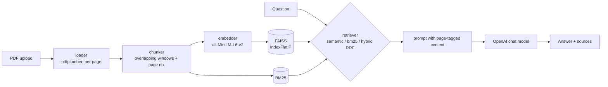

# DocEngine

**Ask questions about any PDF and get answers that cite the page they came from.**

[](https://github.com/vidit-16/DocEngine/actions/workflows/ci.yml)
[](LICENSE)
[](pyproject.toml)

DocEngine is a small retrieval-augmented generation (RAG) app: upload a PDF in a Streamlit UI,
ask a question, and an LLM answers using only the most relevant passages, with page-numbered
sources shown underneath.

> Screenshot / demo GIF: _coming soon_

## Features

- **Page-cited sources**: every chunk keeps the page it was extracted from, shown in the UI and passed to the LLM.
- **Three retrieval strategies**: semantic (FAISS cosine), lexical (dependency-free BM25) and hybrid (reciprocal rank fusion), switchable in the sidebar.
- **Configurable LLM**: OpenAI `gpt-4o-mini` by default, any chat model via `DOCENGINE_LLM_MODEL`.
- **Config module**: all tunables come from `DOCENGINE_*` env vars with validation (`docengine/config.py`).
- **Graceful failures**: empty/corrupt PDFs, scanned PDFs with no text, missing API keys and API errors all produce clear messages instead of stack traces.
- **Measured, not guessed**: a reproducible retrieval evaluation set and A/B script, plus mutation testing.

## Architecture



## Quickstart

### Local

```bash
python -m venv .venv
.venv\Scripts\activate           # Windows; use `source .venv/bin/activate` on macOS/Linux
pip install -r requirements.txt
cp .env.example .env              # then set OPENAI_API_KEY
streamlit run app.py
```

Environment variables are read from the process environment; export them or use a tool like `direnv` / your IDE to load `.env`.

### Docker

```bash
docker build -t docengine .
docker run --rm -p 8501:8501 -e OPENAI_API_KEY=sk-... docengine
```

The image runs as a non-root user, pre-downloads the embedding model and has a healthcheck on `/_stcore/health`.

### Configuration

| Variable | Default | Meaning |
| --- | --- | --- |
| `OPENAI_API_KEY` | - | Required to generate answers |
| `DOCENGINE_LLM_MODEL` | `gpt-4o-mini` | OpenAI chat model id |
| `DOCENGINE_RETRIEVAL_MODE` | `semantic` | `semantic`, `bm25` or `hybrid` |
| `DOCENGINE_CHUNK_SIZE` / `_CHUNK_OVERLAP` | `500` / `100` | Chunk window in characters |
| `DOCENGINE_MIN_CHUNK_LEN` | `50` | Drop chunks shorter than this |
| `DOCENGINE_TOP_K` | `3` | Chunks passed to the LLM |
| `DOCENGINE_EMBEDDING_MODEL` | `all-MiniLM-L6-v2` | sentence-transformers model |

## Testing

```bash
pip install -r requirements-dev.txt
ruff check . && ruff format --check .
pytest --cov=docengine
```

- **69 tests, 98% line coverage** of `docengine/`. No API keys or network needed: LLM clients and the embedding model are mocked; PDFs are generated in-memory.
- **Unit + property tests** (Hypothesis) for chunking invariants, exact BM25 scores, RRF fusion, config validation.
- **Smoke tests** boot `app.py` with Streamlit's `AppTest`.
- **Parity tests**: `Retriever(mode="semantic")` matches the original `search()` API; `load_pdf()` matches the joined output of `load_pdf_pages()`.
- **Mutation testing**: `python scripts/mutation_test.py` kills **68 of 74 mutants (91.9%)**; the 6 survivors are equivalent mutants. See [docs/mutation-testing.md](docs/mutation-testing.md).

### Retrieval A/B

`python -m evaluation.run_eval` runs every retrieval mode over three chunk sizes against
[`evaluation/dataset.json`](evaluation/dataset.json): a synthetic 12-page handbook with 30 questions, each with one gold page.
A hit means the gold page is among the top-k retrieved chunks.

| chunk / overlap | mode | hit@1 | hit@3 | MRR@3 |
|---|---|---|---|---|
| 300 / 50 | semantic | 0.867 | 0.967 | 0.906 |
| 300 / 50 | bm25 | 0.700 | 0.833 | 0.761 |
| 300 / 50 | hybrid | 0.867 | 0.933 | 0.900 |
| **500 / 100** | **semantic** | **0.900** | 0.967 | **0.928** |
| 500 / 100 | bm25 | 0.633 | 0.867 | 0.744 |
| 500 / 100 | hybrid | 0.833 | 0.967 | 0.894 |
| 800 / 150 | semantic | 0.833 | **1.000** | 0.906 |
| 800 / 150 | bm25 | 0.767 | 0.900 | 0.822 |
| 800 / 150 | hybrid | 0.867 | 0.967 | 0.917 |

Takeaways: BM25 alone is clearly weaker on paraphrased questions; hybrid fusion did **not** beat
pure semantic search on this set, so the default stays `semantic` at 500/100 (the original behaviour).
Hybrid remains available for keyword-heavy documents (IDs, codes, names). Full output with latency:
[`evaluation/results/retrieval.md`](evaluation/results/retrieval.md).

**LLM A/B**: `python -m evaluation.run_eval --llm` compares `gpt-4o-mini` and `gpt-4.1-nano` on answer accuracy and latency, writing `evaluation/results/llm.md`.
Requires `OPENAI_API_KEY`; results are not committed yet.

## Project structure

```
.
├── app.py                  # Streamlit UI
├── docengine/
│   ├── config.py           # Settings from env vars, validated
│   ├── loader.py           # PDF -> pages (1-based numbers)
│   ├── chunker.py          # overlapping chunks carrying page numbers
│   ├── embedder.py         # sentence-transformers, normalised
│   ├── vector_store.py     # FAISS inner-product (cosine) index
│   ├── bm25.py             # Okapi BM25, no dependencies
│   ├── retriever.py        # semantic / bm25 / hybrid (RRF)
│   └── llm.py              # OpenAI answer generation
├── evaluation/             # dataset, A/B script, committed results
├── scripts/mutation_test.py
├── tests/
├── docs/
├── Dockerfile, .dockerignore
├── pyproject.toml          # ruff, pytest, coverage config
└── requirements.txt, requirements-dev.txt
```

## Roadmap

- OCR fallback for scanned PDFs
- Multi-document collections and persisted indexes
- Token-aware (rather than character) chunking and a re-ranker stage
- Streaming answers in the UI

## License

[MIT](LICENSE)
